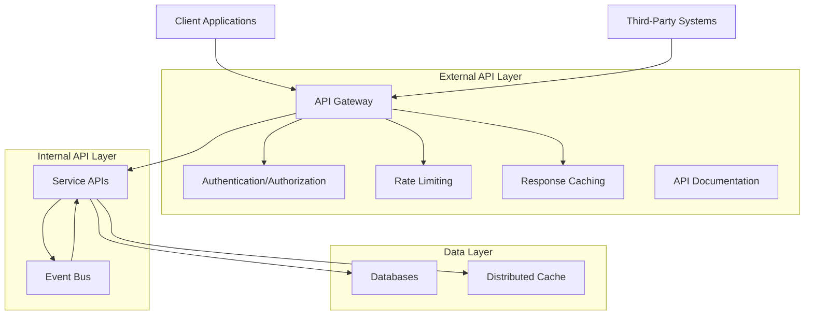

# Domain-Monitor API Design

This document outlines the API architecture for the Domain-Monitor application, defining the API structure, endpoints, authentication mechanisms, and best practices.

## 1. API Architecture Overview

The Domain-Monitor API follows RESTful principles with a well-defined hierarchy of resources. It provides both internal APIs (for service-to-service communication) and external APIs (for clients and third-party integrations).



## 2. API Design Principles

### 2.1 RESTful Resource Design

- **Resource-Oriented**: APIs are structured around resources (nouns) rather than actions
- **Standard HTTP Methods**: Use HTTP methods (GET, POST, PUT, DELETE) according to their defined semantics
- **Hierarchical Resource Structure**: Resources have clear parent-child relationships where appropriate
- **Consistent URL Patterns**: Follow consistent naming conventions for endpoints
- **Stateless Interactions**: Each request contains all information needed to process it

### 2.2 API Versioning Strategy

- **URL-Based Versioning**: Major versions are indicated in the URL path (e.g., `/api/v1/domains`)
- **Header-Based Negotiation**: Minor versions can be requested via Accept headers
- **Backward Compatibility**: New versions maintain compatibility with older clients where possible
- **Deprecation Policy**: Deprecated endpoints are clearly marked and maintained for a defined grace period

### 2.3 API Response Format

```json
{
  "data": {
    // Resource data or collection
  },
  "meta": {
    "timestamp": "2025-10-05T01:37:00Z",
    "version": "1.0",
    "pagination": {
      "page": 1,
      "per_page": 20,
      "total_pages": 5,
      "total_items": 97
    }
  },
  "links": {
    "self": "https://api.domain-monitor.com/v1/domains?page=1&per_page=20",
    "next": "https://api.domain-monitor.com/v1/domains?page=2&per_page=20",
    "prev": null
  }
}
```

### 2.4 Error Handling

```json
{
  "error": {
    "code": "VALIDATION_ERROR",
    "message": "The request contains invalid parameters",
    "details": [
      {
        "field": "domain_name",
        "message": "Domain name must be a valid FQDN"
      }
    ],
    "request_id": "8fd7-a634-42de-9321"
  }
}
```

- **Consistent Error Format**: All errors follow the same structure
- **Appropriate HTTP Status Codes**: Use standard HTTP status codes (4xx for client errors, 5xx for server errors)
- **Detailed Error Messages**: Provide actionable information for debugging
- **Request Identifiers**: Include unique IDs for correlation with logs

## 3. API Authentication and Authorization

### 3.1 Authentication Methods

- **JWT-Based Authentication**: 
  - Used for web UI and mobile clients
  - Short-lived access tokens with refresh token mechanism
  - Token validation at the API Gateway layer

- **API Key Authentication**:
  - Used for server-to-server integrations
  - Keys are associated with specific organizations and permissions
  - Rate limiting applied per API key

- **OAuth 2.0 (Optional)**:
  - Support for third-party application integration
  - Implementation of authorization code flow
  - Scoped access to specific resources

### 3.2 Authorization Model

- **Role-Based Access Control (RBAC)**:
  - Permissions are assigned to roles
  - Users are assigned to one or more roles
  - API Gateway validates permissions for each request

- **Resource-Level Permissions**:
  - Access controls applied at the resource level
  - Organization-based data isolation
  - Support for resource sharing with specific permissions

### 3.3 Security Headers

- Implement security headers for all API responses:
  - `Content-Security-Policy`
  - `X-Content-Type-Options: nosniff`
  - `X-Frame-Options: DENY`
  - `X-XSS-Protection: 1; mode=block`
  - `Strict-Transport-Security: max-age=31536000; includeSubDomains`

## 4. External API Endpoints

### 4.1 Authentication API

| Endpoint | Method | Description |
|----------|--------|-------------|
| `/api/v1/auth/login` | POST | Authenticate user and issue tokens |
| `/api/v1/auth/refresh` | POST | Refresh access token |
| `/api/v1/auth/logout` | POST | Invalidate tokens |
| `/api/v1/auth/api-keys` | GET | List API keys for current user |
| `/api/v1/auth/api-keys` | POST | Create new API key |
| `/api/v1/auth/api-keys/{id}` | DELETE | Revoke API key |

### 4.2 User Management API

| Endpoint | Method | Description |
|----------|--------|-------------|
| `/api/v1/users` | GET | List users (with pagination) |
| `/api/v1/users` | POST | Create new user |
| `/api/v1/users/{id}` | GET | Get user details |
| `/api/v1/users/{id}` | PUT | Update user |
| `/api/v1/users/{id}` | DELETE | Delete user |
| `/api/v1/users/me` | GET | Get current user profile |
| `/api/v1/users/me` | PUT | Update current user profile |

### 4.3 Organization Management API

| Endpoint | Method | Description |
|----------|--------|-------------|
| `/api/v1/organizations` | GET | List organizations |
| `/api/v1/organizations` | POST | Create organization |
| `/api/v1/organizations/{id}` | GET | Get organization details |
| `/api/v1/organizations/{id}` | PUT | Update organization |
| `/api/v1/organizations/{id}` | DELETE | Delete organization |
| `/api/v1/organizations/{id}/users` | GET | List users in organization |
| `/api/v1/organizations/{id}/users` | POST | Add user to organization |
| `/api/v1/organizations/{id}/users/{userId}` | DELETE | Remove user from organization |

### 4.4 Domain Management API

| Endpoint | Method | Description |
|----------|--------|-------------|
| `/api/v1/domains` | GET | List monitored domains |
| `/api/v1/domains` | POST | Add domain to monitor |
| `/api/v1/domains/{id}` | GET | Get domain details |
| `/api/v1/domains/{id}` | PUT | Update monitored domain |
| `/api/v1/domains/{id}` | DELETE | Remove domain from monitoring |
| `/api/v1/domains/{id}/variants` | GET | List domain variants |
| `/api/v1/domains/variants/generate` | POST | Generate variants without saving |

### 4.5 Scanning API

| Endpoint | Method | Description |
|----------|--------|-------------|
| `/api/v1/scans` | GET | List scan jobs |
| `/api/v1/scans` | POST | Create and start new scan |
| `/api/v1/scans/{id}` | GET | Get scan job details |
| `/api/v1/scans/{id}` | DELETE | Cancel scan job |
| `/api/v1/scans/{id}/results` | GET | Get scan results |
| `/api/v1/scan-configs` | GET | List scan configurations |
| `/api/v1/scan-configs` | POST | Create scan configuration |
| `/api/v1/scan-configs/{id}` | GET | Get scan configuration |
| `/api/v1/scan-configs/{id}` | PUT | Update scan configuration |
| `/api/v1/scan-configs/{id}` | DELETE | Delete scan configuration |

### 4.6 Results and Analysis API

| Endpoint | Method | Description |
|----------|--------|-------------|
| `/api/v1/domains/{id}/results` | GET | Get latest results for domain |
| `/api/v1/domains/{id}/results/history` | GET | Get historical results for domain |
| `/api/v1/results/{id}` | GET | Get specific result details |
| `/api/v1/results/{id}/whois` | GET | Get WHOIS data for result |
| `/api/v1/results/{id}/dns` | GET | Get DNS data for result |
| `/api/v1/results/{id}/ssl` | GET | Get SSL/TLS data for result |
| `/api/v1/results/{id}/content` | GET | Get content analysis for result |
| `/api/v1/results/{id}/blacklists` | GET | Get blacklist checks for result |

### 4.7 Alerting API

| Endpoint | Method | Description |
|----------|--------|-------------|
| `/api/v1/alerts` | GET | List alerts (filterable) |
| `/api/v1/alerts/{id}` | GET | Get alert details |
| `/api/v1/alerts/{id}` | PUT | Update alert (e.g., resolve) |
| `/api/v1/alert-configs` | GET | List alert configurations |
| `/api/v1/alert-configs` | POST | Create alert configuration |
| `/api/v1/alert-configs/{id}` | GET | Get alert configuration |
| `/api/v1/alert-configs/{id}` | PUT | Update alert configuration |
| `/api/v1/alert-configs/{id}` | DELETE | Delete alert configuration |

### 4.8 Reporting API

| Endpoint | Method | Description |
|----------|--------|-------------|
| `/api/v1/reports` | GET | List reports |
| `/api/v1/reports` | POST | Generate new report |
| `/api/v1/reports/{id}` | GET | Get report details |
| `/api/v1/reports/{id}/download` | GET | Download report file |
| `/api/v1/reports/{id}` | DELETE | Delete report |
| `/api/v1/report-templates` | GET | List report templates |

### 4.9 Integration API

| Endpoint | Method | Description |
|----------|--------|-------------|
| `/api/v1/webhooks` | GET | List webhook configurations |
| `/api/v1/webhooks` | POST | Create webhook |
| `/api/v1/webhooks/{id}` | GET | Get webhook details |
| `/api/v1/webhooks/{id}` | PUT | Update webhook |
| `/api/v1/webhooks/{id}` | DELETE | Delete webhook |
| `/api/v1/integrations/siem` | GET | List SIEM integrations |
| `/api/v1/integrations/siem` | POST | Configure SIEM integration |
| `/api/v1/integrations/soar` | GET | List SOAR integrations |
| `/api/v1/integrations/soar` | POST | Configure SOAR integration |

## 5. Internal Service APIs

These APIs are used for service-to-service communication and are not directly exposed to external clients.

### 5.1 Domain Variant Service API

| Endpoint | Method | Description |
|----------|--------|-------------|
| `/internal/v1/variants/generate` | POST | Generate domain variants |
| `/internal/v1/variants/validate` | POST | Validate domain variants |
| `/internal/v1/variants/check-registration` | POST | Check if variants are registered |

### 5.2 WHOIS Scanning Service API

| Endpoint | Method | Description |
|----------|--------|-------------|
| `/internal/v1/scan/whois` | POST | Perform WHOIS lookup |
| `/internal/v1/scan/whois/batch` | POST | Perform batch WHOIS lookups |
| `/internal/v1/whois/parse` | POST | Parse raw WHOIS data |

### 5.3 DNS Scanning Service API

| Endpoint | Method | Description |
|----------|--------|-------------|
| `/internal/v1/scan/dns` | POST | Perform DNS lookups |
| `/internal/v1/scan/dns/batch` | POST | Perform batch DNS lookups |
| `/internal/v1/scan/pdns` | POST | Query passive DNS data |

### 5.4 SSL/TLS Scanning Service API

| Endpoint | Method | Description |
|----------|--------|-------------|
| `/internal/v1/scan/ssl` | POST | Perform SSL/TLS certificate scan |
| `/internal/v1/scan/ssl/batch` | POST | Perform batch SSL/TLS scans |
| `/internal/v1/scan/ssl/validate` | POST | Validate SSL/TLS certificates |

### 5.5 Content Scanning Service API

| Endpoint | Method | Description |
|----------|--------|-------------|
| `/internal/v1/scan/content` | POST | Perform website content scan |
| `/internal/v1/scan/content/screenshot` | POST | Capture website screenshot |
| `/internal/v1/scan/content/analyze` | POST | Analyze website content |
| `/internal/v1/scan/content/phishing` | POST | Check for phishing indicators |

### 5.6 Blacklist Scanning Service API

| Endpoint | Method | Description |
|----------|--------|-------------|
| `/internal/v1/scan/blacklist` | POST | Check domain/IP against blacklists |
| `/internal/v1/scan/blacklist/batch` | POST | Batch blacklist checking |
| `/internal/v1/blacklists/status` | GET | Get blacklist providers status |

### 5.7 Risk Scoring Service API

| Endpoint | Method | Description |
|----------|--------|-------------|
| `/internal/v1/risk/score` | POST | Calculate risk score from scan results |
| `/internal/v1/risk/analyze` | POST | Analyze risk factors |
| `/internal/v1/risk/threshold` | GET | Get risk thresholds |

### 5.8 Alerting Service API

| Endpoint | Method | Description |
|----------|--------|-------------|
| `/internal/v1/alerts/evaluate` | POST | Evaluate results against alert rules |
| `/internal/v1/alerts/generate` | POST | Generate alert from findings |
| `/internal/v1/alerts/notify` | POST | Send alert notifications |

## 6. API Rate Limiting

### 6.1 Rate Limit Tiers

| Tier | Requests per Minute | Burst Capacity |
|------|---------------------|----------------|
| Free | 60 | 100 |
| Basic | 300 | 500 |
| Professional | 1,000 | 1,500 |
| Enterprise | 3,000+ (configurable) | 5,000+ (configurable) |

### 6.2 Rate Limit Headers

```
X-RateLimit-Limit: 1000
X-RateLimit-Remaining: 950
X-RateLimit-Reset: 1633386600
```

### 6.3 Rate Limit Scopes

- **Global Limits**: Overall API usage limits
- **Endpoint-Specific Limits**: Higher limits for read operations, lower for write operations
- **Resource-Intensive Endpoints**: Special limits for scanning and generation operations

## 7. API Documentation

### 7.1 OpenAPI Specification

The API is fully documented using OpenAPI 3.0 specification. Documentation is available at:

- Interactive Documentation: `/api/docs`
- OpenAPI JSON: `/api/openapi.json`
- OpenAPI YAML: `/api/openapi.yaml`

### 7.2 Code Samples

The documentation includes code samples for common programming languages:
- JavaScript/TypeScript
- Python
- Java
- Go
- Ruby

### 7.3 Status and Health Endpoints

| Endpoint | Description |
|----------|-------------|
| `/api/health` | Health check endpoint for load balancers |
| `/api/status` | Public status with service availability |
| `/internal/status` | Detailed internal status (authenticated) |

## 8. Event-Driven API Patterns

In addition to the RESTful API endpoints, the Domain-Monitor implements event-driven patterns for real-time updates and asynchronous processing.

### 8.1 WebSocket API

```
wss://api.domain-monitor.com/v1/ws
```

Authenticated WebSocket connections provide real-time updates for:
- Scan job status changes
- New alerts
- Risk score changes
- Task completion notifications

### 8.2 Webhook Events

| Event Type | Description |
|------------|-------------|
| `domain.added` | New domain added to monitoring |
| `domain.variant.discovered` | New domain variant discovered |
| `scan.completed` | Scan job completed |
| `scan.failed` | Scan job failed |
| `alert.created` | New alert generated |
| `alert.resolved` | Alert resolved |
| `risk.score.changed` | Risk score significantly changed |

### 8.3 Event Message Format

```json
{
  "event": "alert.created",
  "version": "1.0",
  "id": "evt_1234567890",
  "created_at": "2025-10-05T01:37:00Z",
  "data": {
    "alert_id": "alt_abcdef123456",
    "domain_id": "dom_7890abcdef",
    "severity": "high",
    "title": "Phishing site detected"
  }
}
```

## 9. API Evolution and Governance

### 9.1 Deprecation Process

1. Mark endpoint/field as deprecated in the documentation
2. Add `Deprecation` and `Sunset` headers to responses
3. Communicate deprecation to users (email, documentation, blog)
4. Maintain deprecated functionality for at least 6 months
5. Remove deprecated functionality after sunset date

### 9.2 Breaking vs. Non-Breaking Changes

**Non-Breaking Changes** (no version change required):
- Adding new endpoints
- Adding optional request fields
- Adding response fields
- Adding new query parameters with defaults

**Breaking Changes** (require version increment):
- Removing or renaming endpoints
- Changing HTTP methods for an endpoint
- Adding required request fields
- Removing response fields
- Changing field types or validation rules

### 9.3 API Governance

- **API Design Reviews**: All new endpoints undergo peer review
- **Automated Testing**: Comprehensive test suite for API functionality
- **Performance SLAs**: Defined response time targets for all endpoints
- **Monitoring**: Real-time tracking of API usage, errors, and performance
- **Developer Feedback**: Mechanism for collecting and addressing API usability feedback