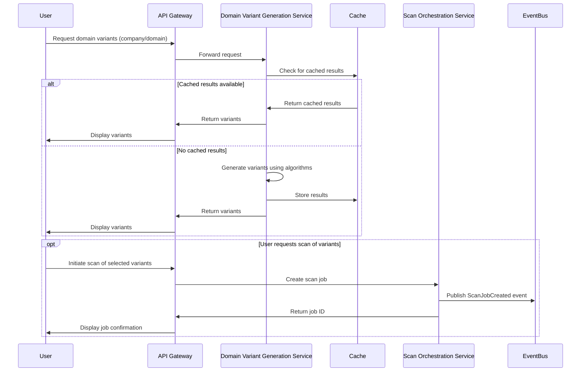
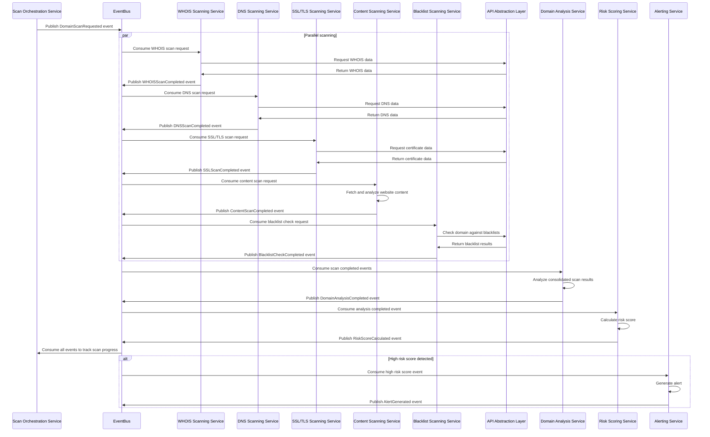
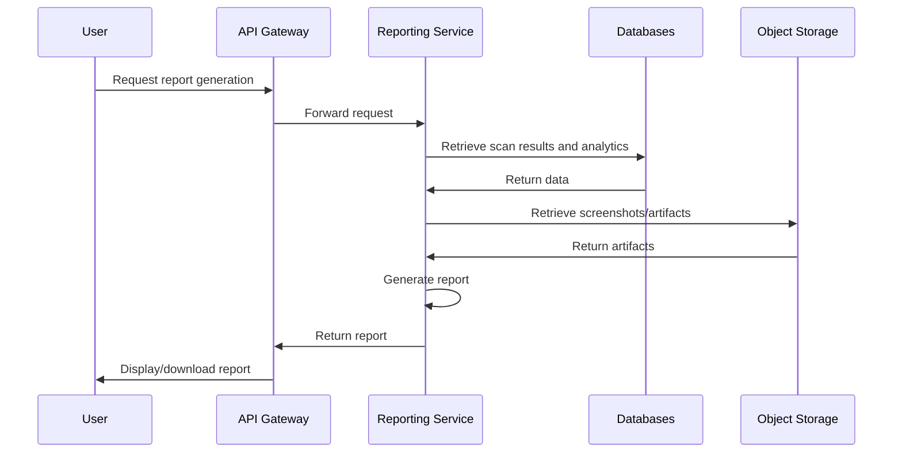
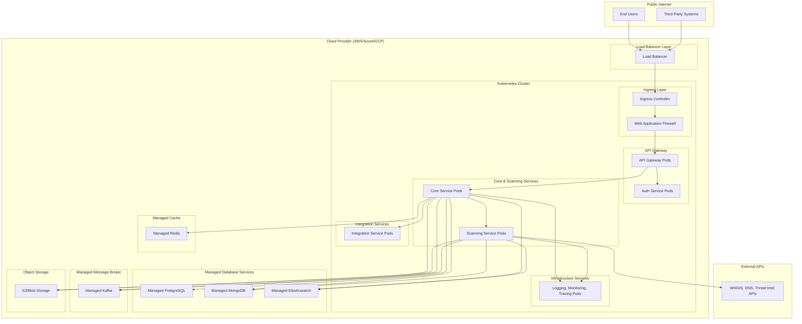
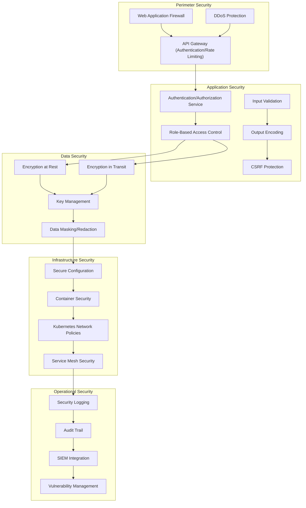

# Domain-Monitor System Architecture

## 1. System Overview

The Domain-Monitor is an enterprise-grade security application designed to detect and analyze domain-based threats such as typosquatting, cybersquatting, and malicious domains. The application follows a microservices architecture with event-driven patterns, designed for cloud-native deployment with high availability, fault tolerance, and scalable performance.

## 2. Architectural Principles

- **Microservices Architecture**: Decompose the application into independently deployable, loosely-coupled services
- **Event-Driven Communication**: Use asynchronous messaging for service decoupling and workflow orchestration
- **Cloud-Native Design**: Leverage containerization, orchestration, and managed services
- **Defense in Depth**: Implement security at every layer of the application
- **Privacy by Design**: Ensure GDPR compliance and data protection measures
- **Horizontal Scalability**: Allow individual components to scale based on demand
- **Resilience**: Design for fault tolerance and graceful degradation
- **Observability**: Enable comprehensive monitoring, logging, and tracing

## 3. High-Level Architecture Diagram

```mermaid
graph TD
    subgraph "Client Layer"
        WebUI["Web UI (React/Angular)"]
        MobileApp["Mobile App (Optional)"]
        ThirdPartyIntegration["Third-Party Integrations"]
    end

    subgraph "API Gateway Layer"
        APIGW["API Gateway"]
        Auth["Authentication/Authorization Service"]
    end

    subgraph "Core Services"
        DomainVariantService["Domain Variant Generation Service"]
        ScanOrchestrationService["Scan Orchestration Service"]
        DomainAnalysisService["Domain Analysis Service"]
        RiskScoringService["Risk Scoring Service"]
        AlertingService["Alerting Service"]
        ReportingService["Reporting Service"]
        UserManagementService["User Management Service"]
    end

    subgraph "Scanning Services"
        WhoisScanService["WHOIS Scanning Service"]
        DNSScanService["DNS Scanning Service"]
        SSLScanService["SSL/TLS Scanning Service"]
        ContentScanService["Website Content Scanning Service"]
        BlacklistScanService["Blacklist Checking Service"]
    end

    subgraph "External API Integration"
        APIAbstractionLayer["API Abstraction Layer"]
        WhoisAPI["WHOIS API Providers"]
        PassiveDNSAPI["Passive DNS API Providers"]
        SSLProviders["SSL/TLS Certificate Providers"]
        BlacklistProviders["Threat Intelligence Providers"]
        FirmographicProviders["Firmographic Data Providers"]
    end

    subgraph "Event Bus"
        EventBus["Message Broker (Kafka/RabbitMQ)"]
    end

    subgraph "Storage Layer"
        RelationalDB["Relational Database (PostgreSQL)"]
        NoSQLDB["NoSQL Database (MongoDB/Elasticsearch)"]
        Cache["Distributed Cache (Redis)"]
        ObjectStorage["Object Storage (S3)"]
    end

    subgraph "Integration Layer"
        SIEMConnector["SIEM Connector"]
        SOARConnector["SOAR Connector"]
        WebhookService["Webhook Service"]
    end

    subgraph "Infrastructure Services"
        Logging["Centralized Logging"]
        Monitoring["Monitoring & Metrics"]
        Tracing["Distributed Tracing"]
        ConfigMgmt["Configuration Management"]
    end

    %% Client Layer Connections
    WebUI --> APIGW
    MobileApp --> APIGW
    ThirdPartyIntegration --> APIGW

    %% API Gateway Connections
    APIGW --> Auth
    APIGW --> DomainVariantService
    APIGW --> ScanOrchestrationService
    APIGW --> ReportingService
    APIGW --> UserManagementService
    APIGW --> AlertingService

    %% Core Service Connections
    DomainVariantService --> EventBus
    ScanOrchestrationService --> EventBus
    DomainAnalysisService --> EventBus
    RiskScoringService --> EventBus
    AlertingService --> EventBus
    ReportingService --> EventBus
    UserManagementService --> RelationalDB

    %% Scanning Service Connections
    EventBus --> WhoisScanService
    EventBus --> DNSScanService
    EventBus --> SSLScanService
    EventBus --> ContentScanService
    EventBus --> BlacklistScanService
    
    WhoisScanService --> APIAbstractionLayer
    DNSScanService --> APIAbstractionLayer
    SSLScanService --> APIAbstractionLayer
    BlacklistScanService --> APIAbstractionLayer
    ContentScanService --> ObjectStorage
    
    %% API Abstraction Layer Connections
    APIAbstractionLayer --> WhoisAPI
    APIAbstractionLayer --> PassiveDNSAPI
    APIAbstractionLayer --> SSLProviders
    APIAbstractionLayer --> BlacklistProviders
    APIAbstractionLayer --> FirmographicProviders

    %% Storage Connections
    WhoisScanService --> NoSQLDB
    DNSScanService --> NoSQLDB
    SSLScanService --> NoSQLDB
    ContentScanService --> NoSQLDB
    BlacklistScanService --> NoSQLDB
    DomainAnalysisService --> NoSQLDB
    RiskScoringService --> NoSQLDB
    
    ScanOrchestrationService --> RelationalDB
    UserManagementService --> RelationalDB
    ReportingService --> RelationalDB
    AlertingService --> RelationalDB
    
    DomainVariantService --> Cache
    RiskScoringService --> Cache
    APIAbstractionLayer --> Cache

    %% Integration Layer Connections
    AlertingService --> SIEMConnector
    AlertingService --> SOARConnector
    AlertingService --> WebhookService
    ReportingService --> SIEMConnector
    
    %% Infrastructure Connections
    DomainVariantService --> Logging
    ScanOrchestrationService --> Logging
    DomainAnalysisService --> Logging
    RiskScoringService --> Logging
    AlertingService --> Logging
    WhoisScanService --> Logging
    DNSScanService --> Logging
    SSLScanService --> Logging
    ContentScanService --> Logging
    BlacklistScanService --> Logging
    
    DomainVariantService --> Monitoring
    ScanOrchestrationService --> Monitoring
    DomainAnalysisService --> Monitoring
    RiskScoringService --> Monitoring
    AlertingService --> Monitoring
    
    APIGW --> Tracing
    DomainVariantService --> Tracing
    ScanOrchestrationService --> Tracing
    DomainAnalysisService --> Tracing
    APIAbstractionLayer --> Tracing
```

## 4. Component Breakdown

### 4.1 Client Layer

| Component | Description | Responsibilities |
|-----------|-------------|-----------------|
| Web UI | Browser-based user interface | Present dashboards, reports, and scan results; Allow configuration of scans and alerting; Provide administrative capabilities |
| Mobile App (Optional) | Native mobile application | Offer on-the-go access to alerts and basic functionality |
| Third-Party Integrations | Integration points for external systems | Allow other security platforms to consume and interact with the Domain-Monitor functionality |

### 4.2 API Gateway Layer

| Component | Description | Responsibilities |
|-----------|-------------|-----------------|
| API Gateway | Entry point for all client requests | Route requests to appropriate services; Handle rate limiting; API versioning; Request validation |
| Authentication/Authorization Service | Identity and access management | Validate user credentials; Issue and validate tokens; Enforce RBAC policies |

### 4.3 Core Services

| Service | Description | Responsibilities |
|---------|-------------|-----------------|
| Domain Variant Generation Service | Generates potential typosquatted domains | Implement permutation algorithms; Generate domain variants based on input domains/company names; Cache common generation results |
| Scan Orchestration Service | Manages the lifecycle of scan jobs | Create, schedule, and track scan jobs; Distribute scanning tasks to specialized scan services; Aggregate scan results |
| Domain Analysis Service | Analyzes scan results for threat indicators | Correlate results from different scan types; Apply detection rules/heuristics; Identify patterns across multiple domains |
| Risk Scoring Service | Computes risk scores for domains | Apply risk scoring algorithms; Prioritize threats based on severity; Track risk score changes over time |
| Alerting Service | Generates and manages alerts | Process high-risk findings; Route alerts to appropriate channels; Track alert acknowledgment and resolution |
| Reporting Service | Generates reports from scan data | Create executive summaries; Generate detailed technical reports; Provide scheduled and on-demand reporting |
| User Management Service | Manages users and permissions | Handle user registration, profiles, and preferences; Manage role assignments; Enforce access controls |

### 4.4 Scanning Services

| Service | Description | Responsibilities |
|---------|-------------|-----------------|
| WHOIS Scanning Service | Retrieves and analyzes WHOIS data | Query WHOIS databases; Parse WHOIS records; Detect suspicious registration patterns |
| DNS Scanning Service | Analyzes DNS records and configurations | Perform DNS lookups; Check DNS configurations; Detect DNS-based threats |
| SSL/TLS Scanning Service | Analyzes SSL/TLS certificates | Validate certificates; Check for misconfigurations; Detect certificate anomalies |
| Website Content Scanning Service | Analyzes website content | Detect phishing sites; Identify brand impersonation; Analyze Javascript behavior |
| Blacklist Checking Service | Checks domains against threat intelligence | Query multiple blacklists; Check IP reputation; Identify known malicious indicators |

### 4.5 External API Integration

| Component | Description | Responsibilities |
|-----------|-------------|-----------------|
| API Abstraction Layer | Abstraction for external APIs | Provide unified interface to external services; Handle API authentication; Manage rate limiting; Implement caching and retries |
| WHOIS API Providers | External WHOIS data sources | Provide current and historical WHOIS data |
| Passive DNS API Providers | External DNS data sources | Provide historical DNS resolution data |
| SSL/TLS Certificate Providers | SSL/TLS certificate data | Provide certificate information and transparency logs |
| Threat Intelligence Providers | External threat data sources | Provide blacklists, malware data, and phishing indicators |
| Firmographic Data Providers | Company data sources | Provide company information and domain associations |

### 4.6 Event Bus

| Component | Description | Responsibilities |
|-----------|-------------|-----------------|
| Message Broker | Messaging middleware | Enable asynchronous communication; Support publish-subscribe patterns; Enable service decoupling |

### 4.7 Storage Layer

| Component | Description | Responsibilities |
|-----------|-------------|-----------------|
| Relational Database | Structured data storage | Store user data, scan configurations, job metadata, and audit logs |
| NoSQL Database | Unstructured/semi-structured data storage | Store scan results, domain data, and threat intelligence |
| Distributed Cache | In-memory caching | Cache frequently accessed data; Reduce API calls; Improve performance |
| Object Storage | Blob storage | Store screenshots, HTML content, and other binary artifacts |

### 4.8 Integration Layer

| Component | Description | Responsibilities |
|-----------|-------------|-----------------|
| SIEM Connector | Integration with SIEM systems | Export alerts and findings to SIEM platforms |
| SOAR Connector | Integration with SOAR platforms | Enable automated response actions |
| Webhook Service | Generic integration mechanism | Send event notifications to configurable endpoints |

### 4.9 Infrastructure Services

| Component | Description | Responsibilities |
|-----------|-------------|-----------------|
| Centralized Logging | Log aggregation and analysis | Collect, store, and analyze application logs |
| Monitoring & Metrics | System and application monitoring | Track health and performance metrics |
| Distributed Tracing | Request tracing across services | Track and analyze request flows across services |
| Configuration Management | Centralized configuration | Manage application and service configurations |

## 5. Data Flow Patterns

### 5.1 Domain Variant Generation Flow

### 5.2 Domain Scanning Flow

### 5.3 Reporting Flow

## 6. Technology Stack Recommendations

### 6.1 Frontend Technologies

- **Web Framework**: React with TypeScript
- **UI Components**: Material-UI or Ant Design
- **State Management**: Redux or Context API
- **Data Visualization**: D3.js, Chart.js, or Plotly
- **API Communication**: Axios or Fetch API

### 6.2 Backend Technologies

- **Programming Languages**: 
  - Go (for scanning services requiring high performance)
  - Node.js with TypeScript (for API Gateway and less resource-intensive services)
  - Python (for ML/AI components and data analysis)

- **API Framework**:
  - Go: Gin or Echo
  - Node.js: Express or NestJS
  - Python: FastAPI or Flask

- **Authentication/Authorization**:
  - OAuth 2.0 / OpenID Connect
  - JWT for token-based authentication
  - Consider Auth0 or Keycloak for identity management

### 6.3 Data Storage

- **Relational Database**: PostgreSQL
  - User management
  - Scan configurations
  - Job metadata
  - Audit logs

- **NoSQL Database**:
  - MongoDB (for scan results and domain data)
  - Elasticsearch (for advanced search capabilities and analytics)

- **Caching**: Redis
  - API response caching
  - Rate limiting
  - Session management
  - Temporary data storage

- **Object Storage**: Amazon S3 or compatible alternative
  - Screenshots
  - Website content snapshots
  - Report artifacts

### 6.4 Messaging and Event Processing

- **Message Broker**: 
  - Apache Kafka (for high-volume event streaming)
  - RabbitMQ (for simpler messaging needs)

- **Stream Processing**:
  - Kafka Streams
  - Apache Flink (for complex event processing)

### 6.5 Infrastructure and Deployment

- **Containerization**: Docker
- **Orchestration**: Kubernetes
- **CI/CD**: GitLab CI, GitHub Actions, or Jenkins
- **Infrastructure as Code**: Terraform or Pulumi
- **Service Mesh**: Istio or Linkerd (for advanced microservices networking)
- **API Gateway**: Kong, Ambassador, or cloud-provider solutions

### 6.6 Monitoring and Observability

- **Logging**: ELK Stack (Elasticsearch, Logstash, Kibana) or Grafana Loki
- **Metrics**: Prometheus with Grafana
- **Distributed Tracing**: Jaeger or Zipkin
- **APM**: Elastic APM or Datadog

### 6.7 Security Tools

- **Secrets Management**: HashiCorp Vault or AWS Secrets Manager
- **Vulnerability Scanning**: OWASP ZAP, Trivy, Clair
- **Static Code Analysis**: SonarQube, Checkmarx
- **Dependency Scanning**: OWASP Dependency-Check, Snyk

## 7. Deployment Architecture

## 8. Security Architecture

### 8.1 Security Layers

### 8.2 RBAC Model

| Role | Description | Permissions |
|------|-------------|------------|
| Administrator | System administration | Full access to all features and settings |
| Security Analyst | Day-to-day security operations | Run scans, view results, manage alerts, generate reports |
| Manager | Oversight and reporting | View dashboards and reports, cannot modify settings |
| API User | Programmatic access | Limited API access based on configured permissions |
| Read-Only User | View-only access | View dashboards and reports, no action permissions |

## 9. Scalability and Performance Considerations

### 9.1 Horizontal Scalability

- All services are designed to be stateless where possible
- Services scale independently based on load
- Kubernetes Horizontal Pod Autoscalers adjust replica count based on CPU/memory usage or custom metrics

### 9.2 Performance Optimization

- **Caching Strategy**:
  - API response caching
  - Distributed caching for sharing data between services
  - Cache invalidation policies to maintain data freshness

- **Asynchronous Processing**:
  - Long-running scans processed asynchronously
  - Non-blocking operations for improved throughput

- **Data Tiering**:
  - Hot data in high-performance storage
  - Infrequently accessed data in cold storage
  - Archival policies for historical scan data

- **Resource Optimization**:
  - Resource limits and requests for all containers
  - Efficient database query design
  - Optimized API calls to external services

## 10. Future Considerations

### 10.1 Machine Learning Integration

- Predictive typosquatting detection
- Automated phishing site classification
- Anomaly detection for suspicious domain patterns
- Visual similarity detection for websites

### 10.2 Advanced Threat Detection

- Deeper content analysis
- Behavioral analysis of suspicious domains
- Infrastructure relationship mapping
- Tracking of threat actor tactics, techniques, and procedures (TTPs)

### 10.3 Automated Response

- Integration with domain takedown services
- Automated blocking via firewall/proxy integration
- Dynamic threat intelligence sharing

## 11. Compliance and Privacy Considerations

- GDPR compliance by design
- Data minimization principles
- Configurable data retention policies
- Privacy impact assessment integration
- Regulatory reporting capabilities