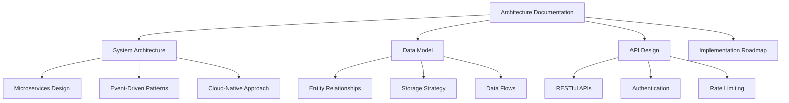
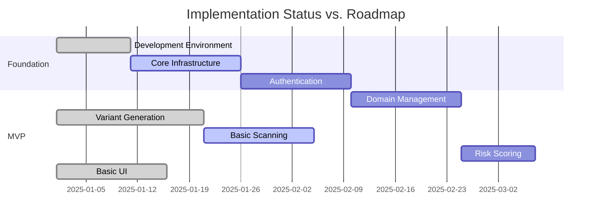

# Domain-Monitor Current State Analysis

## Executive Summary

The Domain-Monitor project is an enterprise-grade security application designed to detect and analyze domain-based threats such as typosquatting, cybersquatting, and malicious domains. The project has established a solid architectural foundation with comprehensive documentation and has begun implementation of core components.

## Current Implementation Status

### ✅ Completed Components

#### 1. Architecture Documentation (Complete)
- **Comprehensive Architecture Design**: Full microservices architecture with event-driven patterns
- **Data Model**: Complete entity relationship model with hybrid storage strategy
- **API Design**: RESTful API specification with authentication and versioning
- **Implementation Roadmap**: Phased delivery approach with clear milestones

#### 2. Frontend Foundation (Partial - MVP Level)
- **Technology Stack**: React 19.1.0 with TypeScript and Material-UI
- **Component Structure**: Modular component architecture with 5 main panels
- **User Interface**: Basic tabbed interface for domain monitoring workflow
- **State Management**: Local state management with React hooks

#### 3. Domain Variant Service (MVP Level)
- **Core Algorithms**: 8 implemented typosquatting algorithms
- **API Endpoints**: Basic REST API for variant generation and scanning
- **Testing**: Unit tests for variant generation algorithms
- **Basic Scanning**: DNS resolution and HTTP status checking

### 🚧 In Progress Components

#### 1. Frontend Components
```typescript
// Implemented Components:
- DomainVariantGenerator ✅
- ScanOrchestration ✅ (basic)
- ResultsDashboard ✅ (basic)
- AlertsPanel ✅ (placeholder)
- ReportsPanel ✅ (basic)
```

#### 2. Backend Services
```typescript
// Domain Variant Service Status:
- Variant Generation: ✅ Complete
- Basic Scanning: ✅ MVP Level
- Advanced Scanning: ❌ Not Implemented
- Risk Scoring: ❌ Not Implemented
```

### ❌ Missing Components

#### 1. Core Microservices Architecture
- **Authentication Service**: Not implemented
- **User Management Service**: Not implemented
- **Scan Orchestration Service**: Not implemented
- **Risk Scoring Service**: Not implemented
- **Alerting Service**: Not implemented
- **Reporting Service**: Not implemented

#### 2. Advanced Scanning Services
- **WHOIS Scanning Service**: Not implemented
- **DNS Scanning Service**: Not implemented
- **SSL/TLS Scanning Service**: Not implemented
- **Content Scanning Service**: Not implemented
- **Blacklist Checking Service**: Not implemented

#### 3. Infrastructure Components
- **API Gateway**: Not implemented
- **Message Broker**: Not implemented
- **Database Layer**: Not implemented
- **Caching Layer**: Not implemented
- **Monitoring & Logging**: Not implemented

## Architecture Assessment

### Strengths

#### 1. Comprehensive Design Documentation


#### 2. Solid Technical Foundation
- **Modern Technology Stack**: React, TypeScript, Node.js
- **Scalable Architecture**: Microservices with event-driven communication
- **Security-First Design**: RBAC, encryption, audit logging
- **Cloud-Native**: Kubernetes, containerization, managed services

#### 3. Domain Expertise Integration
- **Comprehensive Threat Coverage**: 8+ typosquatting algorithms
- **Industry Best Practices**: OWASP, NIST compliance
- **Enterprise Requirements**: GDPR, audit trails, integration capabilities

### Current Gaps

#### 1. Implementation vs. Architecture Mismatch
```typescript
// Current: Monolithic Service
const app = express();
app.post('/api/v1/domains/variants/generate', handler);

// Target: Microservices Architecture
const services = {
  domainVariantService: 'http://domain-variant-service:3000',
  scanOrchestrationService: 'http://scan-orchestration:3001',
  riskScoringService: 'http://risk-scoring:3002'
};
```

#### 2. Missing Core Infrastructure
- No database implementation
- No authentication system
- No message broker for event-driven architecture
- No API gateway for service coordination

#### 3. Limited Scanning Capabilities
```typescript
// Current: Basic DNS + HTTP
const basicScan = {
  dnsResolved: boolean,
  httpStatus: number | null
};

// Target: Comprehensive Analysis
const comprehensiveScan = {
  whois: WHOISRecord,
  dns: DNSRecord[],
  ssl: SSLCertificate,
  content: ContentScan,
  blacklists: BlacklistCheck[],
  riskScore: number
};
```

## Technical Debt Analysis

### High Priority Issues

#### 1. Architecture Alignment
- **Issue**: Current implementation is monolithic, not microservices
- **Impact**: Scalability limitations, deployment complexity
- **Recommendation**: Gradual decomposition starting with domain boundaries

#### 2. Data Persistence
- **Issue**: In-memory storage only
- **Impact**: Data loss, no historical analysis
- **Recommendation**: Implement PostgreSQL + MongoDB hybrid approach

#### 3. Security Implementation
- **Issue**: No authentication or authorization
- **Impact**: Security vulnerability, compliance risk
- **Recommendation**: Implement JWT-based auth with RBAC

### Medium Priority Issues

#### 1. Error Handling
- **Issue**: Basic error handling in services
- **Impact**: Poor user experience, debugging difficulties
- **Recommendation**: Implement comprehensive error handling strategy

#### 2. Testing Coverage
- **Issue**: Limited test coverage (only variant generation)
- **Impact**: Quality risks, regression potential
- **Recommendation**: Implement comprehensive testing strategy

## Implementation Roadmap Assessment

### Phase Alignment Analysis



### Current Phase: Foundation → MVP Transition
- **Foundation Phase**: 60% complete
- **MVP Phase**: 30% complete
- **Overall Progress**: ~25% of total project

## Recommendations

### Immediate Actions (Next 2-4 Weeks)

#### 1. Infrastructure Foundation
```yaml
Priority: Critical
Tasks:
  - Implement PostgreSQL database
  - Set up Redis caching
  - Create basic authentication service
  - Implement API gateway pattern
```

#### 2. Service Decomposition
```yaml
Priority: High
Tasks:
  - Extract authentication logic
  - Create scan orchestration service
  - Implement basic WHOIS scanning
  - Add risk scoring foundation
```

#### 3. Data Persistence
```yaml
Priority: High
Tasks:
  - Design database schema
  - Implement data access layer
  - Add migration system
  - Create backup strategy
```

### Medium-Term Goals (1-2 Months)

#### 1. Advanced Scanning
- SSL/TLS certificate analysis
- Content analysis and phishing detection
- Blacklist integration
- Historical data analysis

#### 2. Enterprise Features
- RBAC implementation
- Audit logging
- SIEM integration
- Advanced reporting

### Long-Term Vision (3-6 Months)

#### 1. Machine Learning Integration
- Predictive threat detection
- Anomaly detection
- Visual similarity analysis
- Automated classification

#### 2. Operational Excellence
- High availability deployment
- Performance optimization
- Security hardening
- Compliance certification

## Risk Assessment

### Technical Risks

| Risk | Probability | Impact | Mitigation |
|------|-------------|--------|------------|
| Architecture complexity | Medium | High | Gradual microservices adoption |
| Performance bottlenecks | High | Medium | Early performance testing |
| Security vulnerabilities | Medium | High | Security-first development |
| Integration challenges | High | Medium | API abstraction layer |

### Business Risks

| Risk | Probability | Impact | Mitigation |
|------|-------------|--------|------------|
| Delayed MVP delivery | Medium | High | Focus on core features |
| Scope creep | High | Medium | Strict change management |
| Resource constraints | Medium | High | Phased implementation |
| Market competition | Low | High | Unique algorithm focus |

## Conclusion

The Domain-Monitor project has established an excellent architectural foundation with comprehensive documentation and clear implementation roadmap. The current implementation represents a solid MVP foundation with working domain variant generation and basic scanning capabilities.

### Key Strengths:
- ✅ Comprehensive architecture design
- ✅ Modern technology stack
- ✅ Security-first approach
- ✅ Working core algorithms

### Critical Next Steps:
1. **Infrastructure Implementation**: Database, authentication, API gateway
2. **Service Decomposition**: Break monolith into microservices
3. **Advanced Scanning**: WHOIS, SSL, content analysis
4. **Enterprise Features**: RBAC, audit logging, reporting

The project is well-positioned for successful delivery following the established roadmap, with an estimated 6-9 months to full enterprise-grade implementation.