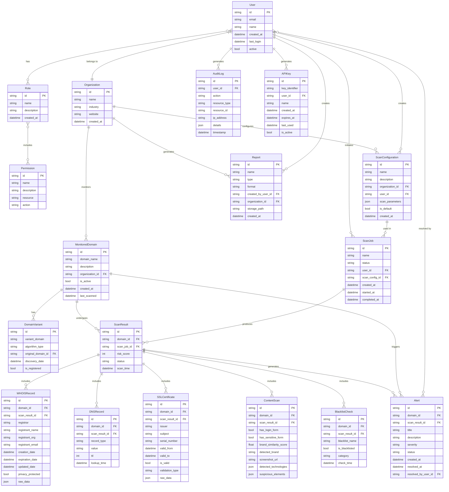

# Domain-Monitor Data Model

This document defines the data model for the Domain-Monitor application, providing a structured view of the entities, relationships, and data flows that support the architecture.

## 1. Entity Relationship Diagram

## 2. Data Storage Strategy

The Domain-Monitor application uses a hybrid data storage approach to handle different types of data efficiently.

### 2.1 Relational Database (PostgreSQL)

The relational database stores structured data with complex relationships that require ACID transactions:

- User and organization management (Users, Roles, Permissions, Organizations)
- Scan configurations and job management
- Monitored domains and their relationships
- Audit logs and security-related data

### 2.2 NoSQL Database (MongoDB/Elasticsearch)

The NoSQL database stores large volumes of semi-structured scan results and findings:

- WHOIS records
- DNS records
- SSL/TLS certificate details
- Website content analysis results
- Blacklist check results

Using a NoSQL database for these datasets provides:
- Flexible schema for evolving scan types and attributes
- Efficient storage of nested JSON data
- Horizontal scalability for large volumes of scan results
- Advanced querying capabilities (especially with Elasticsearch)

### 2.3 Object Storage (S3)

Binary and large objects are stored in object storage:
- Website screenshots
- HTML/CSS/JavaScript content captures
- Generated reports (PDF, CSV, etc.)
- Evidence archives for investigations

### 2.4 Distributed Cache (Redis)

The distributed cache stores ephemeral data requiring fast access:
- Recently generated domain variants
- API response caching
- Session data
- Rate limiting information
- Temporary task status tracking

## 3. Data Flows

### 3.1 Domain Monitoring Flow

1. Users define `MonitoredDomain` entries for their `Organization`
2. The system generates `DomainVariant` records based on monitored domains
3. `ScanJob` instances are created according to `ScanConfiguration` settings
4. Scan services process domains and variants, producing `ScanResult` records
5. Detailed findings are stored as specialized records (WHOIS, DNS, etc.)
6. The Risk Scoring Service analyzes findings and updates risk scores
7. High-risk findings trigger `Alert` records for notification

### 3.2 User Authentication and Authorization Flow

1. Users authenticate via username/password or SSO
2. The system validates credentials and issues a JWT token
3. `Role` and `Permission` records determine access rights
4. `AuditLog` entries record security-relevant actions
5. API access is controlled via `APIKey` records for programmatic access

### 3.3 Reporting Flow

1. Users request report generation based on scan results
2. The Reporting Service queries relevant data from databases
3. Report data is formatted according to templates
4. Reports are stored as files in object storage
5. `Report` records track metadata about generated reports

## 4. Data Retention and Compliance

### 4.1 Data Retention Policies

- User data: Retained as long as account is active, then anonymized after account deletion
- Scan results: Configurable retention period (default: 13 months) to support year-over-year comparison
- High-risk findings: Retained for 3 years to support long-term threat analysis
- Audit logs: Retained for 2 years to support security investigations
- Screenshots and content captures: Retained for 90 days, then archived or purged based on configuration

### 4.2 GDPR Compliance

- Personal data minimization: Only necessary user information is collected
- Data subject access requests: System can report all personal data associated with a user
- Right to be forgotten: User data can be anonymized or deleted upon request
- Data processing records: Maintained for all processing activities
- Data storage limitations: Enforced through automated retention policies

### 4.3 Data Security

- Encryption at rest: All databases and object storage are encrypted
- Encryption in transit: All communication uses TLS 1.3
- Sensitive data protection: PII and credentials are specifically protected
- Access controls: Fine-grained permissions restrict data access
- Data masking: Sensitive data is masked in logs and reports

## 5. Data Evolution Strategy

### 5.1 Schema Migration

- Relational database: Structured migrations with versioning
- NoSQL database: Backward-compatible schema updates
- Data transformation: ETL processes for major data model changes

### 5.2 API Versioning

- API versions are maintained for backward compatibility
- Data model changes are reflected in API contracts
- Deprecated fields and endpoints are marked and eventually removed

### 5.3 Data Enrichment

- External API data is continuously integrated to enrich existing records
- Machine learning models enhance data with predictive classifications
- Historical data is periodically reanalyzed with new detection techniques