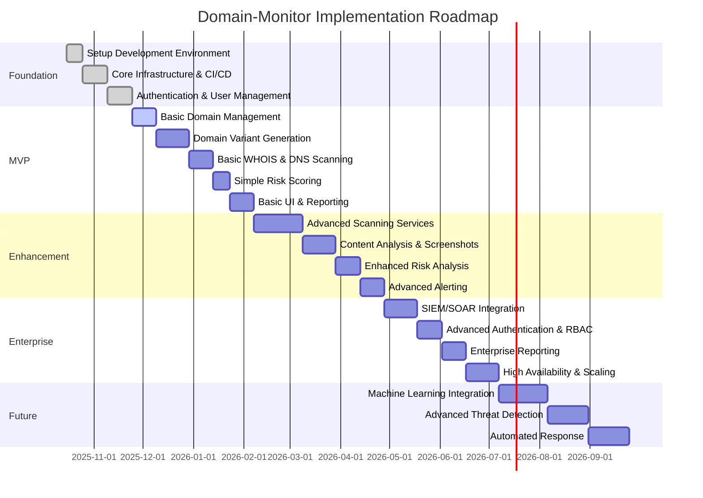
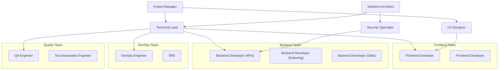

# Domain-Monitor Implementation Roadmap

This document outlines the recommended approach for implementing the Domain-Monitor system, including phased delivery, prioritization, technical considerations, and resource planning.

## 1. Implementation Strategy Overview

The implementation of the Domain-Monitor system will follow an iterative, phased approach that delivers increasing value at each stage while managing technical complexity. This strategy allows for:

- Early delivery of core functionality
- Validation of architectural decisions with real-world usage
- Refinement based on user feedback
- Incremental expansion of capabilities
- Controlled management of technical debt

## 2. Implementation Phases

### 2.1 Phase 1: Foundation (Weeks 1-6)

This phase establishes the essential infrastructure and core framework for the application.

#### Key Deliverables:

1. **Development Environment Setup**
   - Source code repository configuration
   - Docker and Kubernetes setup
   - Development, staging, and production environments
   - Code style, linting, and formatting configuration

2. **Core Infrastructure & CI/CD**
   - Base Kubernetes cluster configuration
   - Database and storage provisioning
   - Message broker setup
   - CI/CD pipeline implementation
   - Monitoring and logging foundations

3. **Authentication & User Management**
   - User registration and authentication system
   - Role-based access control implementation
   - Organization management
   - API key management

#### Technical Focus:
- Establishing scalable, secure infrastructure
- Implementing deployment automation
- Setting up quality gates in CI/CD pipeline
- Creating developer documentation

### 2.2 Phase 2: Minimum Viable Product (Weeks 7-13)

This phase delivers the core functionality required for basic domain monitoring.

#### Key Deliverables:

1. **Basic Domain Management**
   - Domain registration and management
   - Company name to domain mapping
   - Domain validation and metadata

2. **Domain Variant Generation**
   - Implementation of core typosquatting algorithms
   - Basic homoglyph detection
   - TLD variation generation
   - Domain variant storage and categorization

3. **Basic WHOIS & DNS Scanning**
   - WHOIS data retrieval and parsing
   - DNS record analysis
   - API integrations with WHOIS/DNS providers
   - Results storage and basic analysis

4. **Simple Risk Scoring**
   - Basic risk calculation algorithm
   - Rule-based scoring system
   - Domain risk classification

5. **Basic UI & Reporting**
   - Administrative dashboard
   - Domain monitoring views
   - Simple scan results visualization
   - Basic CSV/PDF reporting

#### Technical Focus:
- Implementing secure API design
- Establishing data models and storage patterns
- Creating reusable UI components
- Developing initial automated tests

### 2.3 Phase 3: Enhancement (Weeks 14-22)

This phase expands capabilities with more advanced scanning and analysis features.

#### Key Deliverables:

1. **Advanced Scanning Services**
   - SSL/TLS certificate scanning
   - Blacklist checking service
   - Historical data analysis
   - Scan orchestration improvements

2. **Content Analysis & Screenshots**
   - Website screenshot capture
   - Phishing site detection
   - Brand impersonation detection
   - Content analysis and categorization

3. **Enhanced Risk Analysis**
   - Multi-factor risk scoring
   - Temporal risk analysis (trend detection)
   - Risk visualization enhancements
   - Customizable risk scoring rules

4. **Advanced Alerting**
   - Real-time alerting system
   - Multiple notification channels
   - Alert prioritization logic
   - Alert management workflows

#### Technical Focus:
- Implementing event-driven architecture patterns
- Optimizing performance for scanning operations
- Enhancing security measures
- Improving test coverage

### 2.4 Phase 4: Enterprise (Weeks 23-30)

This phase adds features required for enterprise-grade deployments.

#### Key Deliverables:

1. **SIEM/SOAR Integration**
   - SIEM data export connectors
   - SOAR integration for automated response
   - Standardized alert formats
   - Custom integration capabilities

2. **Advanced Authentication & RBAC**
   - Single Sign-On (SSO) integration
   - Multi-factor authentication
   - Fine-grained access controls
   - Advanced audit logging

3. **Enterprise Reporting**
   - Customizable report templates
   - Scheduled reporting
   - Executive dashboards
   - Compliance-focused reports

4. **High Availability & Scaling**
   - Multi-region deployment
   - Advanced auto-scaling
   - Disaster recovery mechanisms
   - Performance optimization

#### Technical Focus:
- Ensuring enterprise-grade reliability
- Implementing advanced security controls
- Optimizing for large-scale deployments
- Comprehensive documentation for enterprise users

### 2.5 Phase 5: Future Enhancements (Weeks 31+)

This phase explores advanced capabilities that leverage machine learning and automation.

#### Key Deliverables:

1. **Machine Learning Integration**
   - ML models for phishing detection
   - Domain generation pattern analysis
   - Anomaly detection in registration data
   - Predictive risk scoring

2. **Advanced Threat Detection**
   - Infrastructure relationship mapping
   - Attacker behavior analysis
   - Zero-day threat detection
   - Visual similarity detection

3. **Automated Response**
   - Automated takedown workflows
   - Defensive domain registration
   - Integration with security infrastructure
   - Threat intelligence sharing

#### Technical Focus:
- Building ML infrastructure
- Developing specialized AI/ML models
- Creating advanced visualization tools
- Research and innovation partnerships

## 3. Technical Implementation Strategy

### 3.1 Microservices Implementation Approach

The microservices architecture will be implemented using a **Domain-Driven Design (DDD)** approach:

1. **Start with Core Services**: Begin with monolithic-like services that gradually split as boundaries become clearer
2. **Identify Bounded Contexts**: Refine service boundaries based on domain contexts
3. **Evolution over Big-Bang**: Allow microservices to evolve rather than attempting to design the perfect architecture upfront
4. **Service Interaction Patterns**: Use both synchronous (REST/gRPC) and asynchronous (event-driven) patterns as appropriate

#### Initial Service Decomposition:

| Early Phase Services | Later Phase Decomposition |
|----------------------|---------------------------|
| Authentication Service | Remains standalone |
| Domain Management Service | Splits into Domain Service and Variant Generation Service |
| Scanning Service | Splits into specialized scanning services (WHOIS, DNS, SSL, Content, Blacklist) |
| Reporting Service | Remains standalone but with enhanced capabilities |

### 3.2 Database Implementation

#### Data Storage Approach:

1. **Start with PostgreSQL**: Begin with a well-structured relational database for the core data model
2. **Introduce MongoDB**: Add as scan results grow in volume and complexity
3. **Elasticsearch Integration**: Implement for advanced search and analytics in later phases
4. **Redis Caching**: Implement early for performance optimization

#### Migration Strategy:

- Use database migration tools (e.g., Flyway, Liquibase) from the beginning
- Implement data versioning for NoSQL documents
- Create data access layers that abstract storage details from services

### 3.3 API Implementation

#### API Development Approach:

1. **API-First Design**: Define API contracts before implementation
2. **OpenAPI Specification**: Use OpenAPI for documentation and code generation
3. **Consistent Patterns**: Implement standard patterns for pagination, filtering, and error handling
4. **Versioning from Start**: Implement API versioning from the beginning

### 3.4 Frontend Implementation

#### UI Development Strategy:

1. **Component Library**: Develop a reusable component library early
2. **Design System**: Establish a consistent design system
3. **Progressive Enhancement**: Start with essential UI and progressively add features
4. **Responsive Design**: Ensure mobile-friendly design from the start

### 3.5 Security Implementation

#### Security Approach:

1. **Security Requirements**: Define security requirements for each phase
2. **Shift-Left Security**: Integrate security practices throughout the SDLC
3. **Regular Testing**: Conduct regular security testing, including penetration testing
4. **Security Monitoring**: Implement security monitoring from early phases

## 4. Technical Debt Management

To manage technical debt effectively throughout the implementation:

1. **Deliberate Technical Debt Decisions**:
   - Document when and why technical debt is incurred
   - Set explicit timelines for addressing known debt
   - Balance quick delivery with long-term sustainability

2. **Technical Debt Tracking**:
   - Maintain a technical debt registry
   - Assign "interest rates" to prioritize debt items
   - Allocate 20% of each sprint to debt reduction

3. **Refactoring Strategy**:
   - Plan deliberate refactoring phases
   - Use feature toggles to safely deploy large refactorings
   - Maintain high test coverage to enable safe refactoring

4. **Code Quality Gates**:
   - Establish automated quality metrics
   - Set minimum thresholds for test coverage
   - Use static analysis tools to prevent new issues

## 5. Testing Strategy

### 5.1 Test Levels

| Test Level | Implementation Phase | Description |
|------------|----------------------|-------------|
| Unit Tests | From beginning | Test individual components in isolation |
| Integration Tests | From beginning | Test interactions between components |
| API Tests | From beginning | Verify API contracts and behaviors |
| UI Tests | MVP phase | Test user interface functionality |
| Performance Tests | Enhancement phase | Verify system performance under load |
| Security Tests | All phases | Verify security controls and identify vulnerabilities |

### 5.2 Test Automation

1. **Continuous Testing**:
   - Automate tests as part of CI/CD pipeline
   - Run fast tests on every commit, comprehensive tests before deployment
   - Generate test reports and quality metrics

2. **Test Data Management**:
   - Create test data generators for realistic testing
   - Implement data anonymization for production-like tests
   - Maintain dedicated test environments

3. **Testing Tools**:
   - Unit/Integration: Jest, JUnit, pytest
   - API: Postman, REST Assured
   - UI: Cypress, Selenium
   - Performance: JMeter, k6
   - Security: OWASP ZAP, Burp Suite

## 6. Deployment and Operations

### 6.1 Deployment Strategy

1. **Environment Strategy**:
   - Development: For active development
   - Staging: Production-like for testing
   - QA: For quality assurance and validation
   - Production: For end users

2. **Deployment Approach**:
   - Blue/Green deployments for zero downtime
   - Canary releases for high-risk changes
   - Feature flags for controlled rollouts

3. **Infrastructure as Code**:
   - Define all infrastructure using Terraform
   - Use Helm charts for Kubernetes resources
   - Maintain environment parity through code

### 6.2 Operations Strategy

1. **Monitoring Implementation**:
   - Service health and availability monitoring
   - Performance and resource utilization tracking
   - Business metrics and KPIs
   - User experience monitoring

2. **Logging Strategy**:
   - Centralized, structured logging
   - Log correlation with distributed tracing
   - Log retention and archiving policies
   - Log-based alerting for critical issues

3. **Incident Management**:
   - Incident detection and alerting
   - Defined incident response procedures
   - Post-incident reviews and learning
   - Incident documentation and knowledge base

## 7. Team Structure and Skills

### 7.1 Recommended Team Structure

### 7.2 Required Skills

| Role | Required Skills |
|------|-----------------|
| Technical Lead | System architecture, microservices, cloud technologies, security |
| Frontend Developer | React, TypeScript, responsive design, data visualization |
| Backend Developer | Go/Node.js/Python, API design, database design, messaging systems |
| DevOps Engineer | Kubernetes, CI/CD, infrastructure as code, monitoring |
| Security Specialist | Application security, threat modeling, security testing |
| QA Engineer | Test planning, automation, performance testing |
| UX Designer | User research, interaction design, UI design |

### 7.3 Skill Development

1. **Training Areas**:
   - Microservices architecture
   - Cloud-native development
   - Kubernetes and container orchestration
   - Security best practices
   - Domain-specific knowledge (DNS, WHOIS, threat detection)

2. **Knowledge Sharing**:
   - Regular technical talks and workshops
   - Pair programming and code reviews
   - Documentation and knowledge base development
   - External training and certification

## 8. Key Risks and Mitigation Strategies

| Risk | Impact | Likelihood | Mitigation Strategy |
|------|--------|------------|---------------------|
| Technical complexity of distributed architecture | High | Medium | Start with simpler service boundaries; provide architecture guidance; conduct regular architecture reviews |
| Performance issues with large-scale scanning | High | Medium | Implement performance testing early; design for horizontal scaling; optimize critical paths; enable caching |
| API integration limitations or changes | Medium | High | Design abstraction layer for external APIs; implement circuit breakers and fallbacks; monitor API changes |
| Security vulnerabilities | High | Medium | Conduct regular security testing; implement secure coding standards; perform threat modeling; deploy security monitoring |
| Changing requirements | Medium | High | Use agile methodology; maintain flexible architecture; implement feature toggles; focus on core value first |
| Data storage scalability challenges | High | Medium | Design for data partitioning; implement data lifecycle management; benchmark database performance early |

## 9. Success Metrics

### 9.1 Technical Success Metrics

| Metric | Target | Measurement Method |
|--------|--------|-------------------|
| API Response Time | 95% of requests < 200ms | Application Performance Monitoring |
| Service Availability | 99.9% uptime | Uptime monitoring |
| CI/CD Pipeline Efficiency | < 30 min from commit to production | CI/CD metrics |
| Test Coverage | > 80% code coverage | Test reports |
| Defect Density | < 0.5 defects per 1000 lines of code | Static analysis, issue tracking |
| Time to Recovery | < 30 minutes for incidents | Incident reports |

### 9.2 Business Success Metrics

| Metric | Target | Measurement Method |
|--------|--------|-------------------|
| Threat Detection Rate | > 95% of known threats | Controlled tests with known samples |
| False Positive Rate | < 5% of alerts | User feedback, alert resolution data |
| Time to Detection | < 24 hours for new threats | Time delta between domain registration and detection |
| User Satisfaction | > 4.5/5 rating | User surveys, feedback |
| Alert Response Time | < 2 hours for critical alerts | Alert tracking data |
| Cost per Monitored Domain | < $1/month | Cost analysis |

## 10. Implementation Recommendations

### 10.1 Initial Focus Areas

1. **Core Variant Generation Engine**:
   - Prioritize accurate and efficient domain variant generation
   - Implement and test algorithmic foundations
   - Focus on quality over quantity of algorithms initially

2. **Scalable Scan Architecture**:
   - Design for horizontal scaling from the beginning
   - Implement efficient job scheduling and prioritization
   - Create robust error handling and retry mechanisms

3. **External API Integration Layer**:
   - Develop a flexible abstraction for third-party APIs
   - Implement provider-specific adapters
   - Build in rate limiting, caching, and circuit breakers

4. **User Experience**:
   - Focus on analyst workflow efficiency
   - Prioritize clear visualization of threats
   - Ensure actionable intelligence is highlighted

### 10.2 Key Decision Points

| Decision | Timing | Considerations |
|----------|--------|----------------|
| Cloud Provider Selection | Foundation Phase | Cost, services offered, compliance, team expertise |
| Database Technology Split | MVP Phase | Data volume projections, query patterns, scaling needs |
| Machine Learning Approach | Enhancement Phase | Build vs. buy, available expertise, specific use cases |
| Multi-Region Strategy | Enterprise Phase | Compliance requirements, user geography, disaster recovery needs |

### 10.3 Build vs. Buy Recommendations

| Component | Recommendation | Rationale |
|-----------|----------------|-----------|
| Authentication | Buy/Use managed | Use established identity providers or services (Auth0, Cognito) |
| Domain Generation | Build | Core IP of the system, requires custom algorithms |
| WHOIS/DNS Scanning | Hybrid | Use APIs but build custom orchestration and analysis |
| Content Analysis | Hybrid | Use some off-the-shelf tools with custom integration |
| Threat Intelligence | Buy | Leverage established threat intel providers |
| Reporting Engine | Buy | Use established reporting frameworks |
| Alerting System | Build | Requires deep integration with the system |

## 11. Implementation Roadmap Conclusion

The Domain-Monitor implementation requires a balanced approach to deliver value incrementally while building toward a sophisticated, enterprise-grade security platform. By focusing on core capabilities first, validating with users, and progressively enhancing the system, the team can manage complexity and ensure alignment with user needs.

Key success factors include:

1. **Strong architectural foundation** that balances immediate needs with long-term scalability
2. **Disciplined approach to technical debt** that prevents accumulation of critical issues
3. **User-centered development** that prioritizes security analyst workflows and efficiency
4. **Security by design** throughout all implementation phases
5. **Scalable, cloud-native infrastructure** that grows with usage demands

Following this implementation roadmap will provide a clear path to delivering a high-quality Domain-Monitor system that meets the defined requirements while maintaining flexibility for future enhancements.